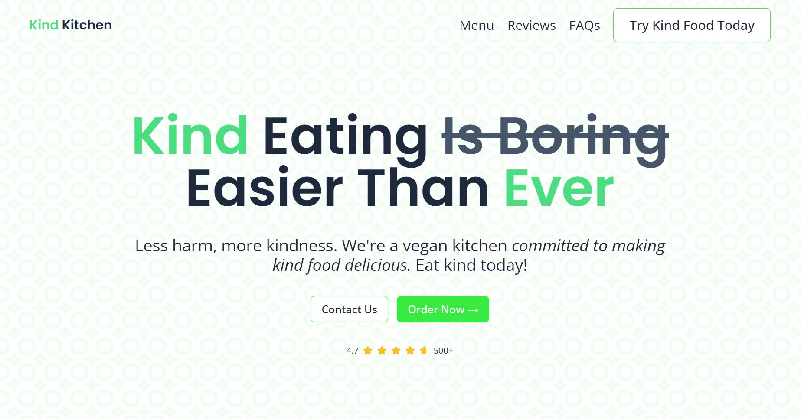
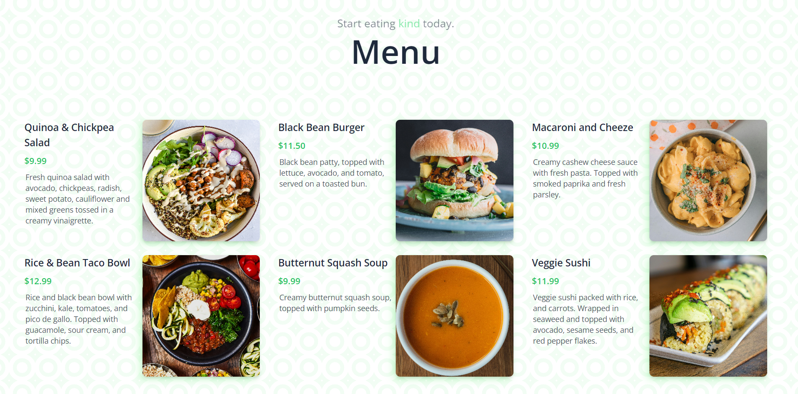
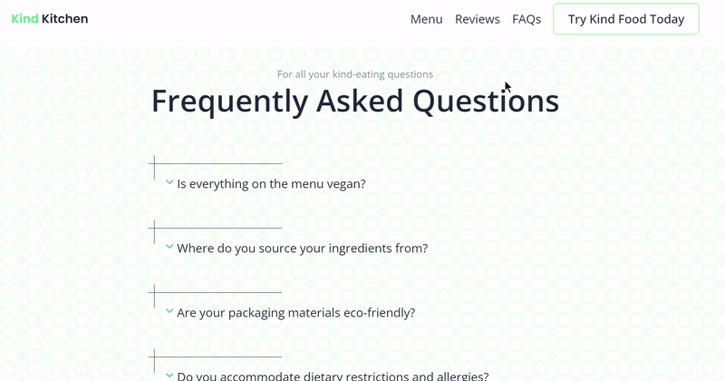
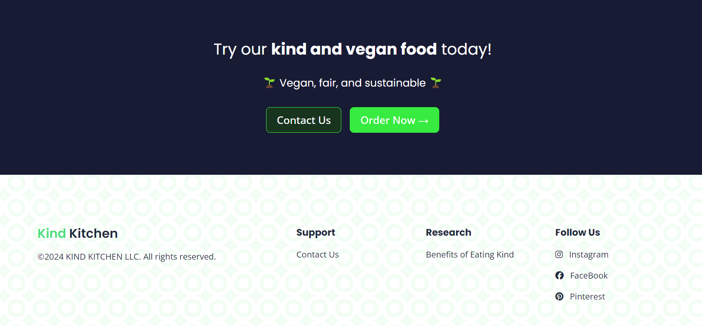
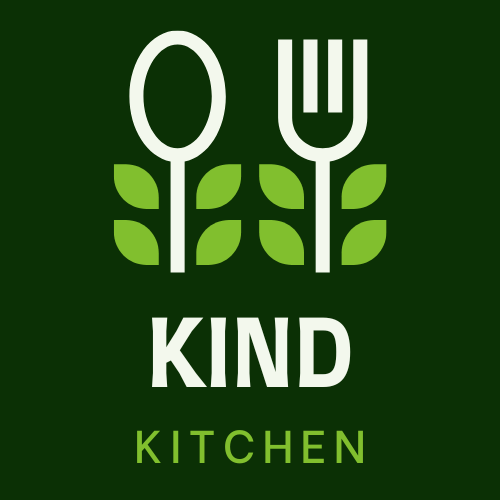

<h1 align='center'>Kind Kitchen 🌱 
  Live Site: https://kindkitchen.netlify.app/
</h1>

## Description

A SvelteKit landing page for a vegan restaurant. Built with <strong>SvelteKit</strong>, <strong>SvelteKit routing</strong>, <strong>Vite</strong>, and <strong>Tailwind CSS</strong>, deployed on <strong>Netlify</strong>.
 Having recently joined <a href='https://www.shoplikeyougiveadamn.com/'>Shop Like You Give a Damn</a>'s team, I wanted to expand my knowledge with SvelteKit, as that is their main programming language. I also wanted to build a site honoring their vegan, fair, and sustainable slogan; something that I too would like to see more of in the world. Being a decade-long vegetarian, Kind Kitchen is the kind of restaurant I'd love to eat at! 🌱

## Features
<li>Hero section and a CTA menu button</li> 

<li>Explore the vegan menu cards full of delicious, yet sustainable choices</li> 

<li>Read through reviews to see what people have said about Kind Kitchen</li> 

<li>Check out FAQs to learn more about Kind Kitchen</li> 

<li>Footer with CTA and a research link about the benefits of eating kind</li> 

<li>Mobile-friendly + mobile nav bar</li> 

<li>Custom site favicon</li> 

